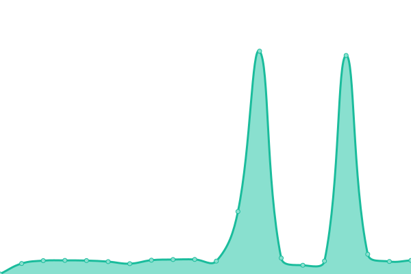
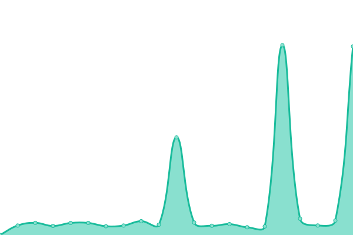

# [📈 Live Status](https://stat.travellings.cn): <!--live status--> **🟧 Partial outage**

This repository contains the open-source uptime monitor and status page for [开往](https://www.travellings.cn/), powered by [Upptime](https://github.com/upptime/upptime).

With [Upptime](https://upptime.js.org), you can get your own unlimited and free uptime monitor and status page, powered entirely by a GitHub repository. We use [Issues](https://github.com/travellings-link/upptime/issues) as incident reports, [Actions](https://github.com/travellings-link/upptime/actions) as uptime monitors, and [Pages](https://stat.travellings.cn) for the status page.

<!--start: status pages-->
<!-- This summary is generated by Upptime (https://github.com/upptime/upptime) -->
<!-- Do not edit this manually, your changes will be overwritten -->
<!-- prettier-ignore -->
| URL | Status | History | Response Time | Uptime |
| --- | ------ | ------- | ------------- | ------ |
|  [Main Site](https://www.travellings.cn) | 🟩 Up | [main-site.yml](https://github.com/travellings-link/upptime/commits/HEAD/history/main-site.yml) | 

 578ms
     
 | 

<a href="https://stat.travellings.cn/history/main-site">100.00%</a>
    

|  [Member List](https://list.travellings.cn) | 🟩 Up | [member-list.yml](https://github.com/travellings-link/upptime/commits/HEAD/history/member-list.yml) | 

 1948ms
     
 | 

<a href="https://stat.travellings.cn/history/member-list">100.00%</a>
    

|  [Wrong Site](https://lalala.travellings.cn) | 🟥 Down | [wrong-site.yml](https://github.com/travellings-link/upptime/commits/HEAD/history/wrong-site.yml) | 

 0ms
     
 | 

<a href="https://stat.travellings.cn/history/wrong-site">14.60%</a>
    

|  [API](https://api.travellings.cn/random) | 🟩 Up | [api.yml](https://github.com/travellings-link/upptime/commits/HEAD/history/api.yml) | 

 1091ms
     
 | 

<a href="https://stat.travellings.cn/history/api">27.73%</a>
    

<!--end: status pages-->

[**Visit our status website →**](https://stat.travellings.cn)

## 📄 License

- Powered by: [Upptime](https://github.com/upptime/upptime)
- Code: [MIT](./LICENSE) © [Anand Chowdhary](https://anandchowdhary.com), supported by [Pabio](https://pabio.com)
- Data in the `./history` directory: [Open Database License](https://opendatacommons.org/licenses/odbl/1-0/)
